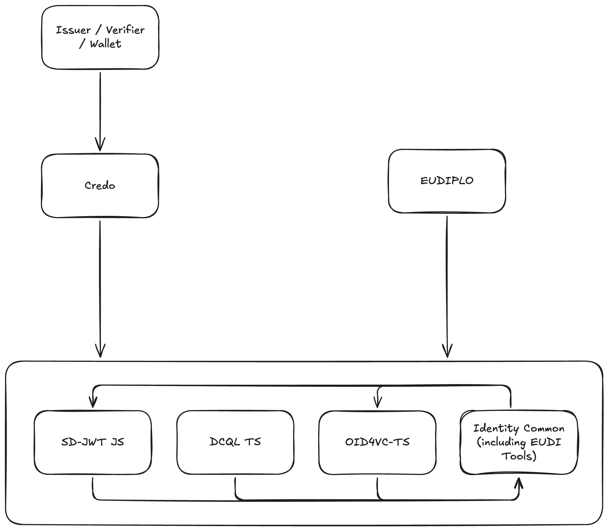

# Project Name

Identity Common TypeScript

# Preferred Maturity Level

lab

# Project Description

To avoid reinventing the wheel, many identity projects share common needs for data types and utility functions. This project aims to provide a shared library of TypeScript types and utilities for identity-related projects, promoting consistency and reducing duplication across the ecosystem.

The project is divided into two main categories:

## Core Identity Utilities

Generic, reusable utilities that can be used across any identity solution:
- X509 certificate parsing, creation and verification
- generic JOSE/JWT implementation, with common validation methods
- generic COSE/CWT implementation, with common validation methods
- JWT/CWT Token Status List implementation

## EUDI-Specific Tools

Tools specific to the EUDI (European Digital Identity) Wallet ecosystem. While the EUDI Wallet is built on open standards such as OpenID4VC and SD-JWT VC, it requires specific extensions for things like Trust, Payments and document signing. Several projects at OWF already focus on integration with the EUDI Wallet, such as EUDIPLO and Credo. By providing EUDI-specific tools in a dedicated library, we avoid unnecessarily expanding the scope of general-purpose OWF libraries with EUDI-specific business logic.

Examples of EUDI-specific tools:
- Implementation of ETSI TS 119 602 for creating, parsing, resolving and verifying Lists of Trusted Entities (LoTE)
- Verifying registration and access certificates, and matching requested attributes against registered DCQL queries
- Creation, validation and parsing of EUDI ARF TS 12 Electronic Payment Strong Customer Authentication extensions, such as custom OpenID4VP Transaction Data types, and SD-JWT VC Type Metadata extensions

The initial project will be based on already existing code implemented in:
- [EUDIPLO](https://github.com/openwallet-foundation-labs/eudiplo) (e.g. ETSI List of Trusted Entities implementation)
- [Paradym Wallet](https://github.com/animo/paradym-wallet) (open source wallet built on Credo, which has several EUDI-specific extensions implemented)
- [EUDI Wallet Functionality](https://github.com/animo/eudi-wallet-functionality) (open source library implementing common EUDI specific requirements)

The goal of the project is to stay lightweight (keep dependencies to a minimum), and platform agnostic (no dependency on platform specific APIs, e.g. Crypto). This ensures that the libraries can be used by a wide range of TypeScript projects implementing identity features.

# Alignment with the OpenWallet Foundation Mission

By providing a common set of types and utilities, this project helps ensure interoperability between different identity solutions. It supports the OpenWallet Foundation's mission to foster collaboration and standardization in the identity space, making it easier for developers to build compatible and robust identity applications.

There is already intention for the `sd-jwt-js`, `oid4vc-ts`, `openid-federation-ts`, `credo-ts`, `eudiplo` libraries under OWF to update to the common library. For example an implementation of the JOSE/JWT standard has been made 3 times in those four libraries.

The project also strengthens the integration of existing OWF projects, promoting usage in combination with existing projects, and ensuring OWF projects build on each other instead of reimplementing different tools. The EUDI-specific tools are intended to build on the core identity utilities in this project, as well as the existing DCQL TS, OpenID4VC TS, and SD-JWT JS projects. They are intended to be used by EUDIPLO and Credo, as well as direct integration for users looking for lower level integration libraries. We have seen good adoption of both higher level OWF projects (such as Credo and EUDIPLO) as well as lower level OWF projects (such as OpenID4VC TS, DCQL TS and SD-JWT JS).

# Code of Conduct

[OpenWallet Foundation code of conduct](https://tac.openwallet.foundation/governance/code-of-conduct/)

# TAC Sponsor

none

# Project License

Apache 2.0

# Source Control

Will be created on Github under the OpenWallet Foundation organization.

# Issue Tracker

Will use Github Issues in the repository.

# External Dependencies

none

# Release Methodology

Managed per library using semantic versioning in a monorepo. Releases will be published to npm.

# Initial Maintainers

- Mirko Mollik - [@cre8](https://github.com/cre8)
- Timo Glastra - [@TimoGlastra](https://github.com/TimoGlastra)
- Berend Sliedrecht - [@berendsliedrecht](https://github.com/berendsliedrecht)
- Alexis Delamare Deboutteville [@marsouin](https://github.com/marsouin)

# Proposed Project Governance

# Financial Sponsorship

none

# Infrastructure

none