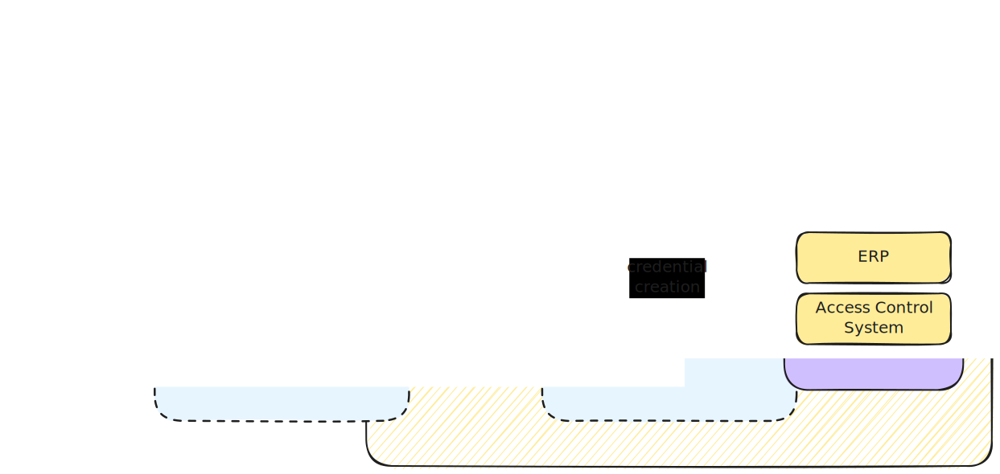

# Project Name
**EUDIPLO**

# Preferred Maturity Level
**Labs**

# Project Description

**EUDIPLO** is a lightweight, open-source **middleware layer** designed to simplify integration with the **European Digital Identity Wallet (EUDI Wallet)** ecosystem.

Its mission: make advanced identity protocols accessible to developers and organizations by wrapping them in easy-to-use, JSON-based APIs. Whether you’re building for government agencies, universities, hospitals, or private enterprises—EUDIPLO lets you **issue and verify credentials** without becoming an identity expert.

Under the hood, EUDIPLO supports the full EUDI Wallet protocol stack, including **OID4VCI**, **OID4VP**, and **SD-JWT VC**, while maintaining a strong focus on **privacy**, **security**, and **interoperability**.

Inspired by agent-based projects like ACA-Py, EUDIPLO takes a fresh, EUDI-native approach:
- **No proprietary lock-in**
- **Runs anywhere via Docker**
- **Minimal config, maximum impact**

It’s built to empower proof-of-concept teams and production systems alike—with fast setup, minimal overhead, and standards-first thinking.

# Alignment with the OpenWallet Foundation Mission

EUDIPLO shares the OWF mission of **interoperability and openness**. It provides a reusable component for issuers and verifiers to interact with EUDI Wallets using open standards and open libraries—many of which originate from the OWF ecosystem itself.

By lowering the entry barrier for organizations and developers, EUDIPLO supports adoption of **user-centric, trustworthy digital identity systems** across Europe. It is fully aligned with the regulatory and technical vision of the **EUDI framework**, but flexible enough to adapt as standards evolve.

# Code of Conduct

The project adopts the [OpenWallet Foundation Code of Conduct](https://tac.openwallet.foundation/governance/code-of-conduct/).

# TAC Sponsor

None at this time.

# Project License

Apache License 2.0

# Source Control

Hosted on GitHub at [https://github.com/cre8/eudiplo](https://github.com/cre8/eudiplo)  
(Planned migration to the OpenWallet Foundation GitHub organization.)

# Issue Tracker

All issues, feature discussions, and enhancements are tracked via GitHub Issues.

# External Dependencies

No external service dependencies or licenses required. EUDIPLO runs self-contained in a Docker container.

# Release Methodology

Currently in early development, EUDIPLO follows a **"release when ready"** model. As the project matures, a more predictable release cadence will be adopted.

- Semantic Versioning ([SemVer 2.0.0](https://semver.org)) is followed.
- The `main` branch reflects active development and may be unstable.
- The `latest` Docker tag will always point to the most recent stable release.

# Initial Maintainers

- [@cre8](https://github.com/cre8)

# Proposed Project Governance

The project will start with a **lightweight governance model**, led by core contributors and the initial maintainer(s). Contributions, feature proposals, and issues are welcome from the community.

As adoption grows, the governance structure will evolve to reflect community participation and best practices.

# Financial Sponsorship

None currently.

# Infrastructure

No dedicated infrastructure is required at this stage.